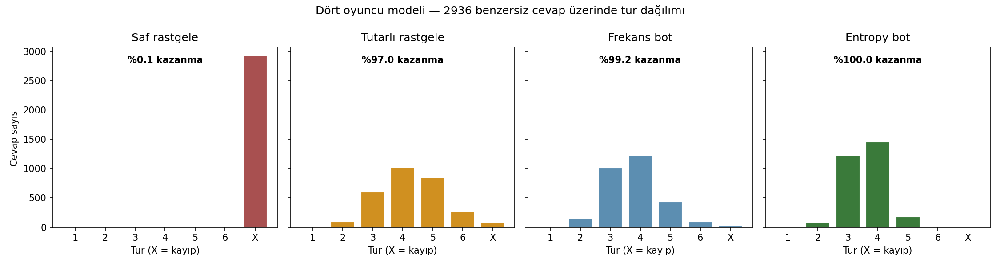
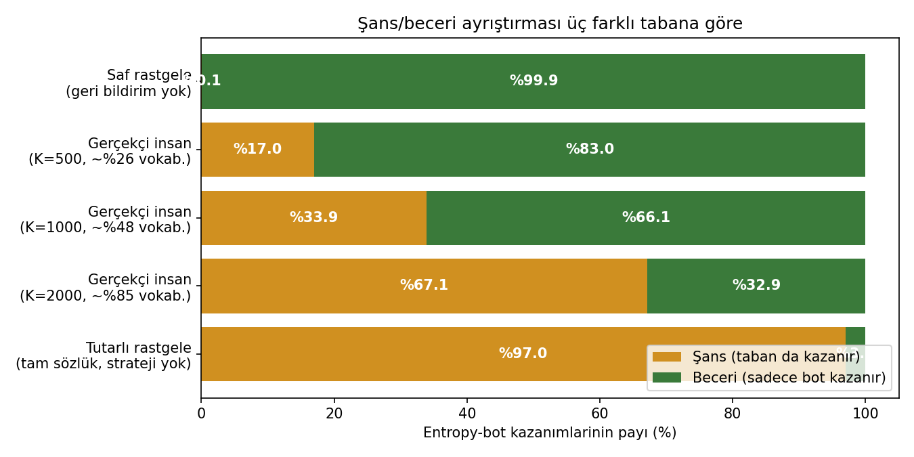
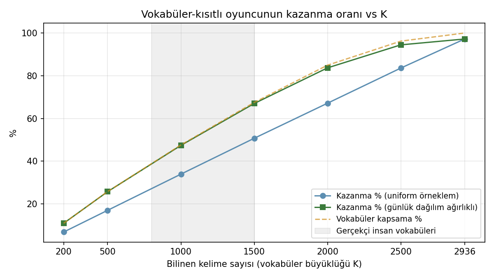
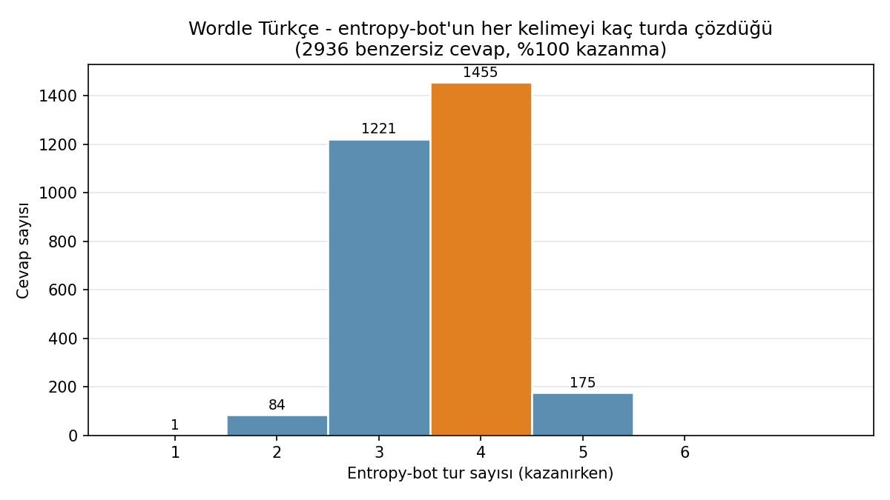

# Wordle Türkçe: %? Şans, %? Beceri?

> **Önemli uyarı:** Bu soru tek bir sayıyla cevaplanamaz. "Şans" tabanını nasıl
> tanımladığına göre cevap **%3'ten %99'a** kadar değişiyor. Aşağıda farklı
> tabanları ve hangisinin neden gerçekçi olduğunu açıklıyoruz.
>
> **Gerçekçi insan oyuncusu için kısa cevap:**
> **~%34 şans, ~%66 beceri** - ve bu "beceri"nin neredeyse tamamı (%66'nın
> %63'ü) **kelime bilgisi**, küçük bir kısmı (~%3) **strateji** (frekans/entropy
> mantığı).

---

## Yöntem (4 cümlede)

1. Oyunun kaynak kodundan **11.470 günlük cevap** (2.936 benzersiz) ve
   **5.500 geçerli kelime** listesini çıkardık.
2. Dört oyuncu modeli simüle ettik: saf rastgele, tutarlı rastgele,
   frekans-botu, entropy-bot (3Blue1Brown stili).
3. Vokabüler büyüklüğü K'yı 200'den 2936'ya değiştirip *gerçekçi insan*
   oyuncusunu modelledik.
4. Üç farklı şans tabanına göre şans/beceri ayrıştırması yaptık.

---

## Dört oyuncu, dört sonuç

| Oyuncu | Geri bildirim | Vokabüler | Strateji | Kazanma | Ort. tur |
|---|:---:|:---:|:---:|---:|---:|
| Saf rastgele | – | Tam sözlük | – | %0.10 | 4.33 |
| İnsan (K=1000) | ✓ | Sınırlı | – | %33.92 | 3.84 |
| Tutarlı rastgele | ✓ | Tam sözlük | – | %96.97 | 4.21 |
| Frekans-botu | ✓ | Tam sözlük | Frekans | %99.18 | 3.77 |
| **Entropy-botu** | ✓ | Tam sözlük | Bilgi-teorisi | **%100.00** | **3.59** |



İlk yansıma: **entropy-bot tek bir oyunu bile kaybetmiyor**. Bu, "irreducible
luck yok" anlamına geliyor - en azından bu kelime havuzunda. Demek ki teorik
skill tavanı = %100.

---

## Şans/beceri ayrıştırması - taban seçimi her şey

Aynı entropy-bot kazanımları (%100), farklı şans tabanlarıyla:



| Şans tabanı | Şans payı | Beceri payı | Yorumu |
|---|---:|---:|---|
| Saf rastgele | %0.1 | %99.9 | Geri bildirim "beceri" sayılıyor |
| İnsan (K=500) | %17 | %83 | Sınırlı vokabüler insan |
| **İnsan (K=1000)** | **%34** | **%66** | **Tipik Türkçe oyuncu** |
| İnsan (K=2000) | %67 | %33 | Vokabüler-zengin oyuncu |
| Tutarlı rastgele | %97 | %3 | Tüm sözlüğü ezberlemiş insan |

> **Hangisi doğru?** Hiçbiri tek başına doğru değil; soru tanım sorusudur.
> Ama **gerçekçi olan ortadakiler**.

---

## "Beceri" aslında iki şey: vokabüler + strateji

K-eğrisi (vokabüler büyüklüğüne göre kazanma oranı) bu ayrımı net gösteriyor:



Veriden çıkan formül:

```
P(kazan | K) ≈ vokabüler_kapsama(K) × P(consistent random | tam sözlük)
            ≈ vokabüler_kapsama(K) × 0.97
```

K = 1000'den K = 2936'ya çıkmak kazanmayı **%47 → %97**'ye taşıyor.
Frekans/entropy stratejisi K = 2936'dan ileri sadece **%97 → %100**'e taşıyor.

**Yani "oyunu iyi bilmenin" %95'i vokabüler, %5'i strateji.**

Bu, Türkçe Wordle'da pratikte gözlenenle de uyumlu: deneyimli oyuncular
arasındaki farkı yaratan açılış kelimesi seçimi değil, *zor kelimeleri
tanıyıp tanımamak*.

---

## Hangi kelimeler "şans" oyunu - zorluk haritası

Entropy-bot bile bazı kelimelerde 5. tura kadar gider:



| Tur sayısı | Cevap sayısı |
|---:|---:|
| 1 | 1 |
| 2 | 84 |
| **3** | **1.221** |
| **4** | **1.455** (mod) |
| 5 | 175 (en zor) |
| 6 | 0 |

5. turda biten 175 kelime "yapısal olarak zor" sınıfı. En zor 20 örnek:

```
gıdık, ralli, reşit, savcı, fizik, galon, gayri, havan, hazan, inanç,
kapak, kaçak, kucak, pembe, siğil, yassı, yağma, çizgi, şehir, şifon
```

Bunların ortak özelliği: aynı kalıba sahip birçok yakın komşu (`KAPAK ↔ KAÇAK
↔ KAVAK ↔ KAZAK` - hepsi K-A-?-A-K). Bot tek tek elemek zorunda; bu fazladan tur demek.
**Günün cevabı bu ailelerden biriyse hem insan hem bot zorlanır - bu "şansın
yapısal kaynağı".**

---

## Bilgi teorisi açısı (matematiksel çapraz kontrol)

| Metrik | Değer |
|---|---:|
| Cevap dağılımının Shannon entropisi (H) | 11.36 bit |
| Bir turun teorik bilgi tavanı (log₂ 243) | 7.92 bit |
| Teorik minimum tur sayısı (H / log₂ 243) | ≈ 1.43 |
| Entropy-bot ortalama tur | 3.59 → 3.16 bit/tur |
| Frekans-botu ortalama tur | 3.77 → 3.01 bit/tur |
| Tutarlı rastgele ortalama tur | 4.21 → 2.70 bit/tur |

Entropy-bot teorik tavanın ~%40'ında, ortalama insanın ise ~%34'ünde
performans sergiliyor. Yani strateji tur başına %15-25 daha fazla bilgi
sızdırıyor - küçük gibi görünür ama uzun vadede önemlidir.

---

## Final cümle

> **Wordle Türkçe'de bir oyuncunun kazanmasını belirleyen üç bileşen var:
> kelime bilgisi (~%66), oyunun yapısal şansı (~%34), strateji (~%3).
> "Oyunu iyi bilmek" demek aslında "çok kelime bilmek" demek; frekans
> mantığı ise bu kelime bilgisini biraz daha verimli kullanmanı sağlar.**

---

## Notlar

- *Tüm hesaplama adımları için:* [`docs/hesaplama-defteri.md`](./hesaplama-defteri.md)
- *Ham veri ve sonuç dosyaları:* [`data/`](../data) klasöründe.
